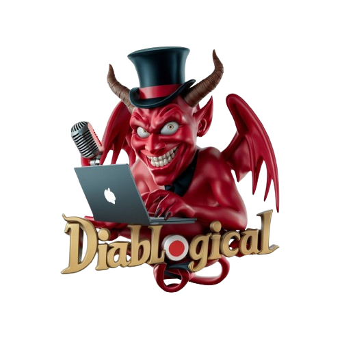

# diablogical

> Image generated on [ideogram.ai](https://ideogram.ai/) with the prompt "A striking 3D render of a mischievous demon, adorned with a wicked smile, a top hat, and possessing a laptop and a microphone. The demon's captivating pose represents the enthralling content of "Diablogical," which combines dark humor and sinister intrigue. The vibrant color palette skillfully blends dark and light hues, evoking a sense of playful humor and subtle menace. The overall design masterfully captures the essence of an irresistibly engaging and diabolically delightful blogging experience., 3d render"

## TODO: [(See `TODO.md`)](./TODO.md)

