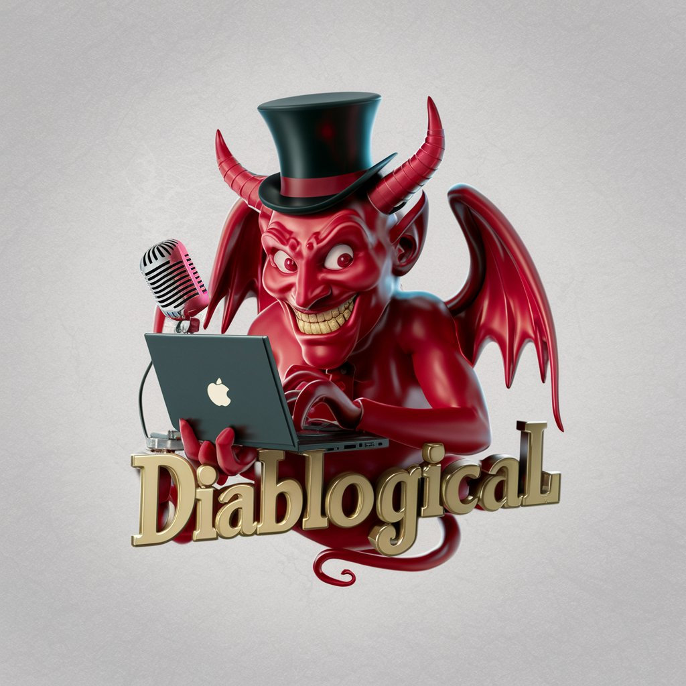

# diablogical

> Image generated on [ideogram.ai](https://ideogram.ai/) with the prompt "A striking 3D render of a mischievous demon, adorned with a wicked smile, a top hat, and possessing a laptop and a microphone. The demon's captivating pose represents the enthralling content of "Diablogical," which combines dark humor and sinister intrigue. The vibrant color palette skillfully blends dark and light hues, evoking a sense of playful humor and subtle menace. The overall design masterfully captures the essence of an irresistibly engaging and diabolically delightful blogging experience., 3d render"

## TODO:

  - Core

    - [ ] Convert webpage (blogs, essay, article, etc.) to audio format
    - [ ] Call LLM to turn tables, equations, code, etc. to natural language
      - So you don't hear "def main(x: int) -> None:..." lol, but rather a summarization of such things
    - [ ] Multimodality to describe images, graphs, charts, and tables

  - Interface

    - [ ] Dead simple web UI, where you bring your own OpenAI/Hugginface key, provide links, and it creates the "podcast" for you
      - diablogical.com/{link of post or shortened url (using is.gd or tinyurl)}
    - [ ] Create browser extensions to create audio for webpage
      - [ ] Also have it "dropdown" when an audio version is avaiable
    - [ ] Create mobile apps to send/share these audio webpages for later consumption
    - [ ] Create "podcasts" of posts:
        - [ ] Personalized, weekly recap of RRS (any feed) 
          - [ ] Intro summary, transitions, etc., hacked together by LLM call
        - [ ] Curated collection of persons' blog posts

  - Storage

    - [ ] Store generated pages in database
      - This is where a lot of value will come from: TTS models cost money - crowdsource this compute

